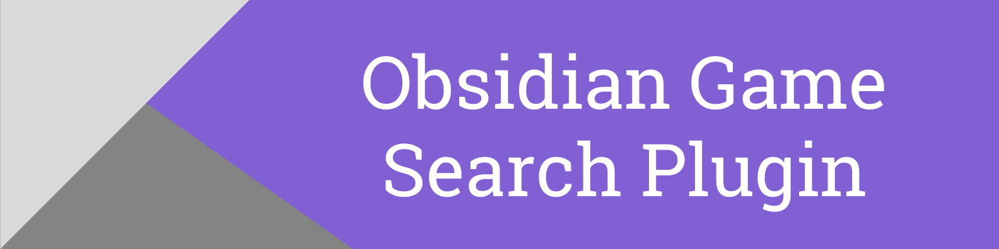
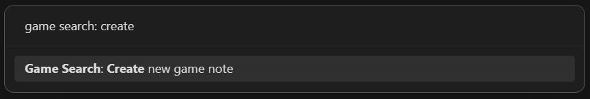
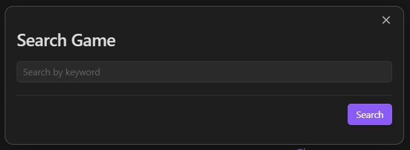
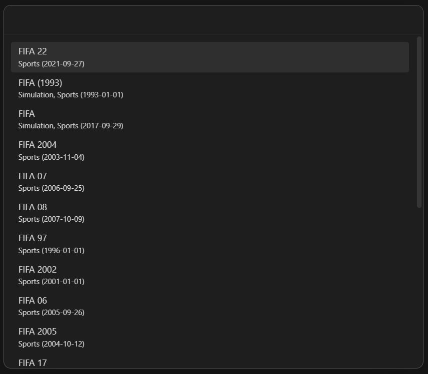
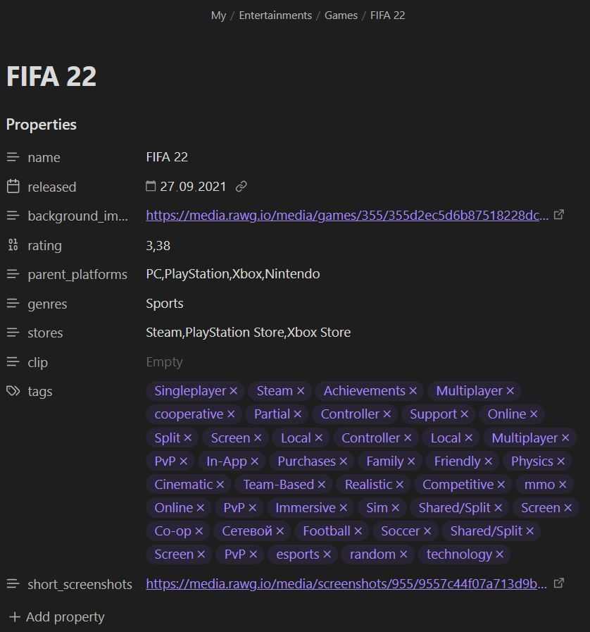
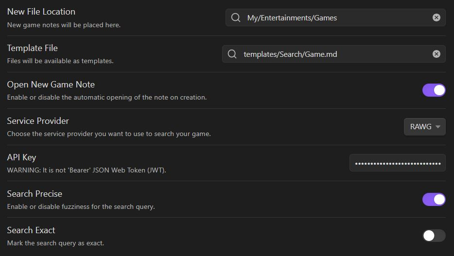
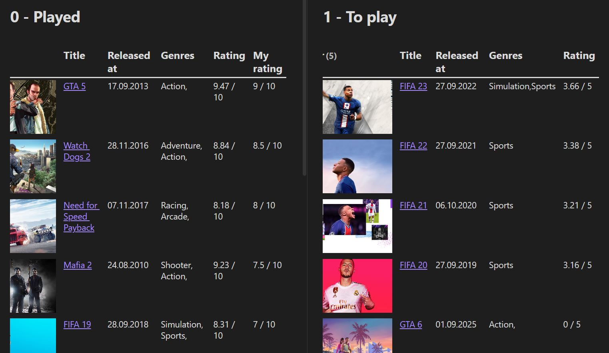

_Easily create game notes._


[](https://github.com/Gubchik123/obsidian-game-search-plugin/actions/workflows/pages/pages-build-deployment)

<br>

## Features

-   Flow:
    -   Create a new game note.
    -   Search for game by keywords.
    -   Select the game from the search results.
    -   Get the game information immediately in the Obsidian note.
-   Settings:
    -   Set the folder location where the new file is created.
    -   Set the template file location.
    -   Set up the services that you use to search for game.
-   Third-party plugins integration:
    -   Use the [Dataview plugin](https://obsidian.md/plugins?id=dataview) to render the game notes.
    -   Use the [Templater plugin](https://github.com/SilentVoid13/Templater) with.
-   Advanced:
    -   Enables [Inline scripts](#inline-script) for templates.

<br>

## How to install

### From Community Plugins

Click the link to install the Game Search plugin: [Install Link](https://obsidian.md/plugins?id=game-search)

**OR**

Search in the Obsidian Community plugin. And install it.

<p align="center"></p>

### Manually (from GitHub)

1. Clone the repository to your Obsidian plugins folder.

```bash
git clone https://github.com/Gubchik123/obsidian-game-search-plugin.git
```

2. Install the dependencies.

```bash
yarn install
```

3. Build the plugin.

```bash
yarn build
```

4. Reload Obsidian and enable the plugin in the settings.

<br>

## How to use

### 1. Click the ribbon icon (dice), or execute the command "Create new game note".

<p align="center"></p>

### 2. Search for game by keywords.

<p align="center"></p>

### 3. Select the game from the search results.

<p align="center"></p>

### 4. Voila! A note has been created.

<p align="center"></p>

<br>

## How to use settings

<p align="center"></p>

### New file location

Set the folder location where the new file is created. Otherwise, a new file is created in the Obsidian Root folder.

### Template file

You can set the template file location. There is an example template at the bottom.

### Open new game note

Enable or disable the opening of the new game note after creation.

### Service Provider

You can set up the services that you use to search for game. Only RAWG are available now.

#### RAWG API Settings

##### RAWG API Key

Set the API key for RAWG.

> You can get an API key from [RAWG](https://developer.thegamedb.org/v3/reference/intro/authentication#api-key-quick-start).

> 🚧 **WARNING**
>
> API key is not 'Bearer' JSON Web Token (JWT).

##### Search precise

Enable or disable fuzziness for the search.

##### Search exact

Mark the search as exact.

<br>

## Example template

Personally I use the following template to create game notes ;)

> Please also find a definition of the variables used in this template below (look at: [Template variables definitions](#template-variables-definitions)).

```markdown
---
created: "{{date: DD.MM.YYYY}} {{time: HH:mm}}"
tags:
    - Entertainment
    - Game
status: TO PLAY
cover:: "{{background_image}}"
---

## 🎮 Game Review -> {{name}}


### ❓ Information

Title:: {{name}}
Release-date:: {{released}}
Rating:: {{rating}}
Genres:: {{genres}}
Tags:: {{tags}}
Parent-platforms:: {{parent_platforms}}
Stores:: {{stores}}

#### Screenshots

<%=game.short_screenshots.map(screenshot => ``).join("\n")%>

#### Clip


#### Simple quiz

1. Player Bases 1. [ ] Kids 2. [ ] Everyone
   ...
   ...
2. Score:: 0
```

> The idea of the template was taken from the [OB_Template](https://github.com/llZektorll/OB_Template/blob/main/0A_Templates/0A_8_Reviews/0A_8_1_GameReview.md). Look through the repository for more examples.

<br>

## Dataview rendering

<p align="center"></p>

Here is the dataview query used in the demo

### List of played games

````
```dataview
TABLE WITHOUT ID
	"" as Cover,
	link(file.link, Title) as Title,
	Release-date as "Released at",
	Genres,
	round(Rating + 5, 2) + " / 10" as Rating,
	Score + " / 10" as "My rating"
FROM  "My/Entertainments/Games" AND #Game
WHERE status = "PLAYED"
SORT Score DESC, Rating DESC, Title ASC
```
````

### List of games to play

````
```dataview
TABLE WITHOUT ID
	"" as Cover,
	link(file.link, Title) as Title,
	Release-date as "Released at",
	Genres,
	Rating + " / 5" as Rating
FROM  "My/Entertainments/Games" AND #Game
WHERE status = "TO PLAY"
SORT Score DESC, Rating DESC, Title ASC
```
````

<br>

## Template variables definitions

Please find here a definition of the possible variables to be used in your template. Simply write `{{name}}` in your template, and replace name by the desired game data, including:

| name              | type             | description                                    |
| ----------------- | ---------------- | ---------------------------------------------- |
| name              | string           | The name of the game.                          |
| released          | string           | The release date of the game.                  |
| background_image  | string           | The cover image URL of the game.               |
| rating            | float            | The average vote of the game.                  |
| parent_platforms  | array of strings | The parent platforms of the game.              |
| genres            | array of strings | The genres of the game.                        |
| stores            | array of strings | The stores of the game.                        |
| clip              | string           | The clip URL of the game.                      |
| tags              | array of strings | The tags of the game.                          |
| short_screenshots | array of strings | The URLs of the short screenshots of the game. |

<br>

## Advanced

### Inline Script

#### To print out a game object:

````
```json
<%=game%>
```
````

or

````
```json
<%=JSON.stringify(game, null, 2)%>
```
````

#### When you want to list of tags:

```
---
Tags: <%=game.tags.map(tag_name =>`\n  - ${tag_name}`).join('')%>
---

Tags: <%=game.tags.map(tag_name => `[[Tag/${tag_name}]]`).join(', ')%>
```

<br>

## License

[Obsidian Game Search Plugin](https://github.com/Gubchik123/obsidian-game-search-plugin) is licensed under the [MIT License](https://github.com/Gubchik123/obsidian-game-search-plugin/blob/master/LICENSE.md).

<br>

## Contributing

Feel free to contribute.

You can create an [issue](https://github.com/Gubchik123/obsidian-game-search-plugin/issues/new) to report a bug, suggest an improvement for this plugin, ask a question, etc.

You can make a [pull request](https://github.com/Gubchik123/obsidian-game-search-plugin/compare) to contribute to this plugin development.

<br>

## Support

If this plugin helped you and you wish to contribute :)

Buy me coffee on [buymeacoffee.com/Gubchik123](https://www.buymeacoffee.com/Gubchik123)

<a href="https://www.buymeacoffee.com/Gubchik123" target="_blank"></a>
